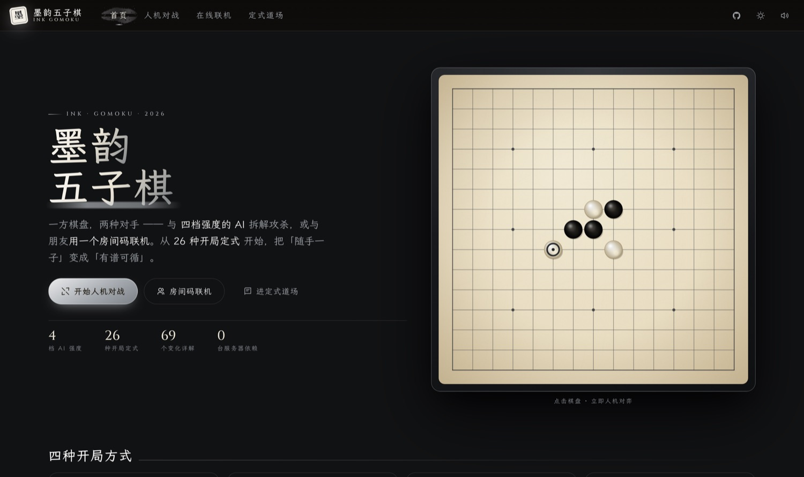
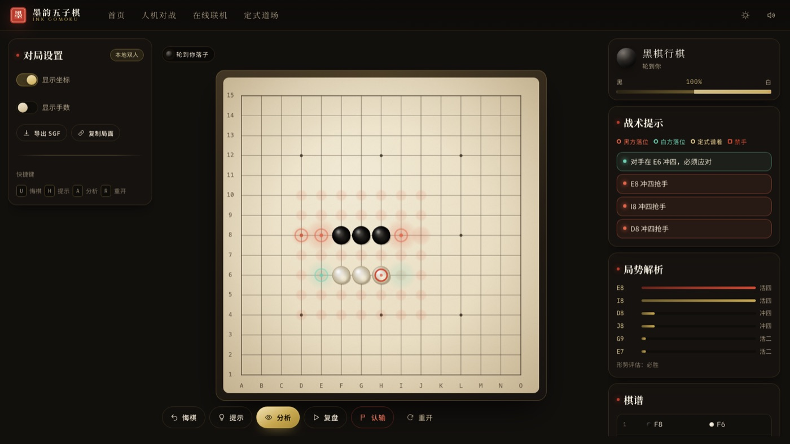
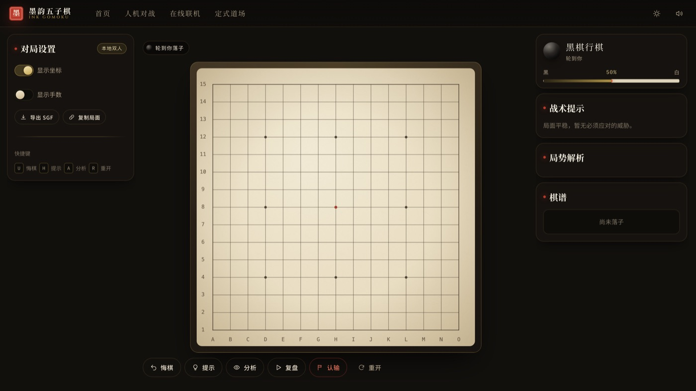
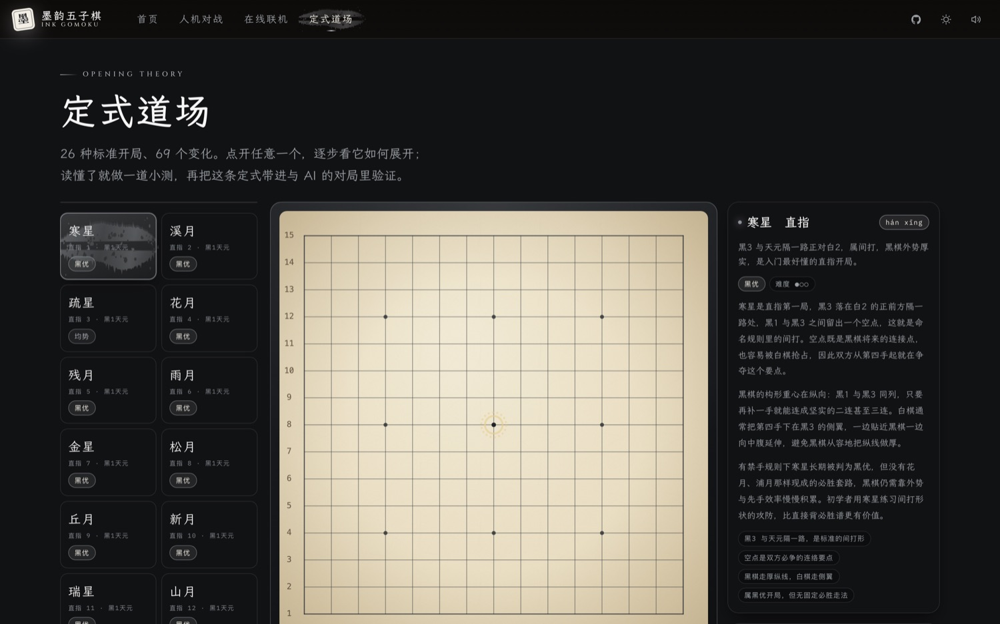
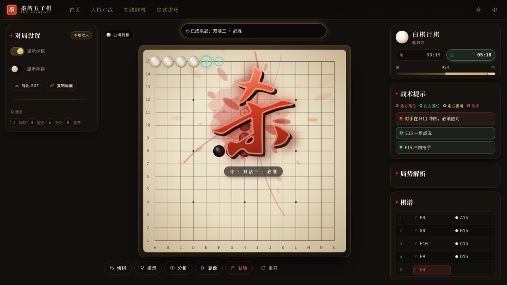
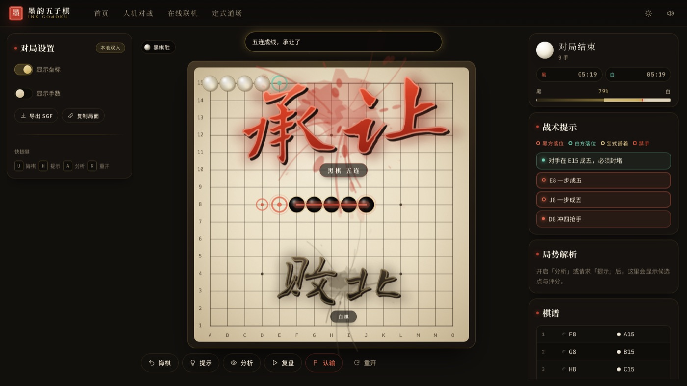
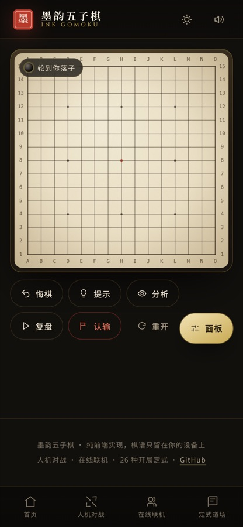

<div align="center">

# 墨韵五子棋 · Ink Gomoku

**一方棋盘，两种对手。会算杀的 AI，能联网的朋友，还有 26 种开局定式。**

纯前端 · 零后端 · 可安装到手机桌面

[](https://github.com/nomagicln/gomoko-must-win/actions/workflows/deploy.yml)
[](LICENSE)


[**立即开战 →**](https://nomagicln.github.io/gomoko-must-win/)

</div>



---

## 三件事，都做到底

### 一、人机对战：四档棋力，一个会算杀的对手

| 档位 | 深度 | 特征 | 棋力参考 |
| --- | --- | --- | --- |
| 入门 Novice | 2 层 | 会漏杀、会犯错，适合刚学会规则 | 业余 5 级 |
| 进阶 Adept | 4 层 | 会封冲四和活三，偶尔走出好手 | 业余 1 段 |
| 大师 Master | 8 层 | 识别双活三与四三杀，攻守均衡 | 业余 4 段 |
| 宗师 Grandmaster | 12 层 | 长链 VCF 算杀，几乎不给第二次机会 | 专业棋手 |

AI 完全跑在浏览器里（放在 Web Worker 中，界面始终 60fps）：

- **Alpha-Beta + PVS**，迭代加深 + 置换表（Zobrist 增量哈希）+ 杀手/历史启发式排序
- **威胁深度延伸**：走出「四」这类强制手不消耗深度，因此能算穿连续冲四
- **VCF 算杀**：独立搜索「连续冲四取胜」的路线，找到就把整套杀法摆在棋盘上
- **查表法评估**：把「7 格窗口 × 2 色」的棋形预计算成 16384 项查找表，一次全盘评估约 900 次查表，叶子节点毫无压力
- **强制着法优先**：每个节点先检查「我能否成五 / 对手能否成五」，绝不会漏杀漏防

打开「分析」会铺开热力图，并按阵营着色，「局势解析」列出 AI 的前 6 个候选点与评分。

对局页还配了**棋钟**：默认「只计时」记录黑白双方累计用时；也可以选 5 分 + 5 秒 / 15 分 + 5 秒 / 30 分 + 10 秒的 Fischer 加秒赛制，归零判负（限时下剩余不足 1 分钟会闪红）。联机时每手用时随落子同步，两边看到的表一致。



对局界面采用「左设置 / 中棋盘 / 右提示」三栏固定布局：棋盘与操作条永远停在原位，两侧面板各自独立滚动，宽屏窄屏都不会被裁切。



### 二、在线联机：房间码，点对点，不经过任何服务器

GitHub Pages 只能托管静态文件，所以联机用 **WebRTC 点对点**：

```
房主浏览器 ──┐                          ┌── 对手浏览器
             └─ 一次信令握手（PeerJS）──┘
             之后所有着法直连传输，端到端加密
```

- 点「生成房间码」得到 5 位邀请码，朋友输入即可入座
- 支持聊天、悔棋协商、认输、再来一局、延迟显示
- 若所在网络拦截了信令服务，会明确提示并引导改用**本地双人**
- 没有账号、没有房间表、没有棋谱留存在任何服务器上

### 三、定式道场：26 种开局，69 个变化，25 道小测

- **交互演示**：逐手推进或自动播放，当前手的讲解会高亮，要点逐条列出
- **小测校验**：系统出题，你在棋盘上直接落子作答；答案与解析一步到位
- **进度留存**：学过的变化记在本地，进度环一眼可见
- **带进对局**：点「与 AI 演练」，自动按该定式开局，第 7 手开始由你接手验证
- **实时识别**：对局前 14 手自动比对开局库，走出定式时盖印提示，脱谱时也会提醒



杀局成型的瞬间 —— 泼墨红「杀」：



---

## 那些让人「哇」一下的细节

| 触发 | 效果 |
| --- | --- |
| 走出定式 | 墨迹晕染横幅滑入：「定式 · 花月」，并给出谱着 |
| **形成杀局**（双活三 / 四三 / VCF 算杀） | **泼墨红「杀」**一笔写就、四散飞溅，配合墨晕与轻微震屏 |
| **连成五子** | **泼墨「承让」**（朱砂）与角落的**「败北」**（焦墨）同时展开，中间留着那一笔胜利连线 |
| 三三 / 四四 / 连珠长连 | 朱砂叉直接标在禁手点上，不可落子 |
| 手机落子 | 手指上方浮出**放大镜**，精确点选不被指尖遮挡 |
| 每一步落子 | 黑曜石 / 羊脂玉棋子带高光与投影，落子有涟漪，音效由 WebAudio 现场合成 |

**泼墨不是贴图**：每个字都由「志莽行书 / 龙藏」毛笔字体 + 渐变填充 + 硬边重影 + 斜切构成，背后的墨团与飞溅墨点则用带种子的随机数**每次现画**，逐帧向外扩散 —— 所以每一局的「杀」字飞溅都不一样。

**落位提示按阵营配色**，威胁等级交给形状：

| 颜色 | 含义 | 形状 |
| --- | --- | --- |
| 朱砂红 | 黑方的潜在落位 | 成五/必胜 = 粗实环＋内核；冲四 = 实环＋内核；活三 = 细虚线环 |
| 青玉绿 | 白方的潜在落位 | 同上 |
| 鎏金 | 定式谱着 | 虚线圆环 |
| 朱砂叉 | 禁手点 | × |

热力图同样按阵营着色：行棋方是暖色，对手是冷色，一眼分得清「我该往哪打、哪里必须堵」。

五连定局的那一刻 —— 中间留着胜利的那一笔，上方「承让」，下方「败北」：



**视觉方向**：「宋式水墨 × 现代博物馆」。以墨为底、以宣纸为盘、以朱砂为印、以鎏金为饰。棋盘纸纹、纤维、做旧暗角全部由 Canvas 程序化生成，没有一张位图资源。

---

## 移动端是一等公民

<table>
<tr>
<td width="46%"></td>
<td>

- **触屏落子 + 放大镜**：手指上方浮出 1.9× 放大视图，落点用朱砂圆环锁定
- **底部抽屉**：棋谱 / 工具分组放进可上滑的抽屉，单手可及；桌面端自动变为右侧常驻侧栏
- **底部标签栏**：四个主入口一键切换，带安全区适配（刘海屏、Home Indicator 都不挡）
- **44px 触控目标**、`touch-action` 精确控制、双击缩放已禁、触觉反馈（`navigator.vibrate`）
- **横竖屏自适应**，棋盘尺寸随视口高度收缩，保证「棋盘 + 操作条」一屏放下
- **PWA 清单**：可「添加到主屏幕」，全屏运行

</td>
</tr>
</table>

---

## 技术栈与架构

**零运行时依赖**（除 WebRTC 联机所需的 PeerJS，且按需动态加载）。没有框架，没有 UI 库，没有图标字体。

```
src/
├─ core/            规则内核（与 UI 完全解耦）
│  ├─ board.ts        棋盘、落子、悔棋、胜负判定、禁手点枚举
│  ├─ patterns.ts     五连 / 活四 / 冲四 / 活三 的定义式判定
│  ├─ renju.ts        连珠禁手（三三、四四、长连，且「五连优先」）
│  ├─ zobrist.ts      增量哈希
│  ├─ sgf.ts          SGF 棋谱读写
│  └─ coords.ts       记谱法（A–O / 1–15，天元 = H8）
├─ ai/
│  ├─ shapes.ts       7 格窗口棋形查找表 + 全盘评估 + 单点启发式
│  ├─ analyze.ts      威胁分析：热力图、必杀点、双威胁识别
│  ├─ search.ts       Alpha-Beta/PVS + 置换表 + 迭代加深 + VCF
│  ├─ engine.ts       四档难度预设 + Worker 客户端（含主线程兜底）
│  ├─ worker.ts       Web Worker 入口
│  └─ book.ts         定式库前缀树：识别开局、给出谱着
├─ ui/
│  ├─ renderer.ts     Canvas 棋盘渲染器（纸纹、棋子、热力图、动效、放大镜）
│  ├─ controller.ts   对局流水线：规则 + AI + 定式 + 特效
│  ├─ audio.ts        WebAudio 合成音效（落子/印章/古琴）
│  ├─ fx.ts           全屏特效（墨晕、朱砂印章、定式横幅）
│  └─ dom.ts          极简 DOM 工具与内联图标
├─ views/            首页 / 对弈 / 联机 / 定式道场
├─ net/peer.ts       PeerJS 点对点传输层（动态 import）
└─ data/openings.ts  26 种开局定式数据
```

**测试**：`vitest` 共 41 项，覆盖胜负判定、禁手、棋形评估、AI 战术（抓杀/封堵/VCF/双威胁）、四档难度时限、19 路棋盘、整局自对弈、棋钟（加秒 / 超时 / 暂停 / 同步），以及 26 种定式数据的合法性与识别。

```bash
npm install
npm run dev        # 本地开发
npm test           # 单元测试
npm run build      # 类型检查 + 生产构建
npm run preview    # 预览构建产物
```

`scripts/` 下是无头 Chrome 验收脚本（开发期使用，不参与站点构建）：

```bash
# 先启动预览服务与带 CDP 的 Chrome（chrome --headless=new --remote-debugging-port=9222 ...）
node scripts/screenshot.mjs <url> <out.png> [宽] [高] [等待毫秒]   # 截图 + 收集 console 错误
node scripts/e2e.mjs                                              # 人机对战全链路（真实点击棋盘）
node scripts/e2e-online.mjs                                       # 双标签页 WebRTC 联机全链路
node scripts/e2e-fx.mjs                                           # 泼墨杀局 / 承让败北 特效链路
```

---

## 部署

推送到 `main` 即由 GitHub Actions 自动部署到 Pages（`.github/workflows/deploy.yml`：安装 → 跑测试 → 构建 → 发布）。

站点地址：**https://nomagicln.github.io/gomoko-must-win/**

---

## 隐私

没有账号系统，没有分析脚本，没有第三方追踪。棋谱只存在于你的浏览器（`localStorage`），联机时通过端到端加密的 WebRTC 通道直达对手。唯一的对外请求是加载 Google Fonts 与（仅在进入联机页时）连接 PeerJS 信令服务器。

---

## 关于定式数据的坦诚说明

26 种开局的**黑 3 打点**经过两个独立来源交叉验证（[九游开局表](https://www.9game.cn/wzq/8325163.html)、[namu wiki 26주형](https://m.namu.moe/w/26%EC%A3%BC%ED%98%95)），并与[爱五子棋助记图](http://iwzq.renjucaffe.com/thread/1113.html)的命名规则互相印证。其中：

- **白 4 / 黑 5** 有公开资料支撑的有 21 种；溪月、雨月与原型的同型关系存在走子顺序差异，丘月缺公开资料，这几局的后续着法属于合理构拟。
- **游星 / 彗星**（有禁手规则下的白必胜开局）缺少公开棋谱，变化用于演示白棋的取胜思路，而非背谱用。
- 各变化的**白 6** 是常见续着的示意，不构成权威棋谱。
- 各开局的**优劣势标注**多取自韩文资料（连珠规则），其中流星的「均势」判断存在分歧，请以实战验证为准。

这些内容用于**理解形状与思路**，不是比赛背谱库。欢迎提 Issue 指正。

---

## 许可

[MIT](LICENSE)。字体由 Google Fonts 提供（Noto Serif SC / Noto Sans SC / Cinzel / IBM Plex Mono，均为 SIL OFL）。
